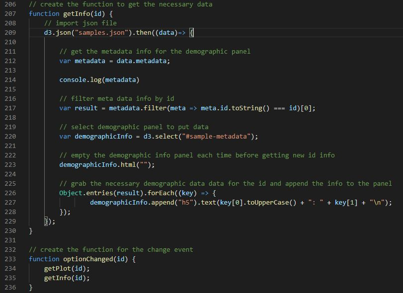
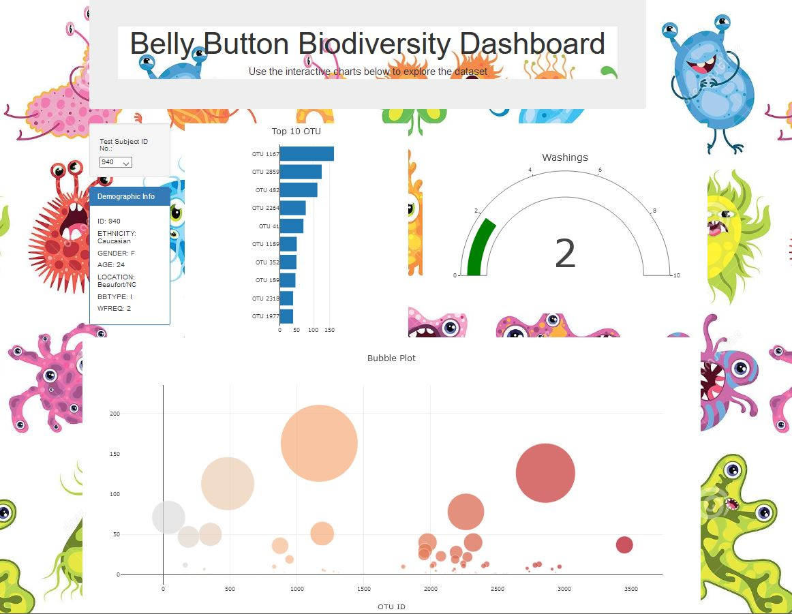

# Belly Button Biodiversity 

## Project Purpose

Build an interactive dashboard to explore the Belly Button Biodiversity dataset, which catalogs the microbes that colonize human navels.  The dataset reveals that a small handful of microbial species (also called operational taxonomic units, or OTUs, in the study) were present in more than 70% of people, while the rest were relatively rare.

## Process

### Step 1 - Plotly

Using the D3 library we'll read in samples.json.  Using a horizontal bar chart with a dropdown menu to display the top 10 OTUs found in the individual.
 - 

 ### Step 2 - Create a Bubble Chart that displays each sample
 - 

### Steps 3 and 4 - Displaying the same metadata and each key-value pair from the metadata JSON object

- 

## Results
The Interative Belly Button Biodiversity Dashboard updates the graphs whenever a new sample is selected from the Test Subject ID menu on the left of the webpage.

- 

Note: Due to compatibility issues on some systems please run html files in Live Server

